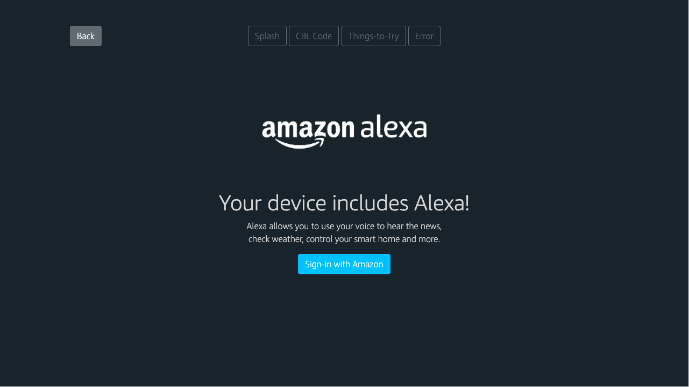

# AVS-OOBE-Screens-Demo
Demo for Alexa Voice Service OOBE flow for screen-based devices.

This demo is based on example screens provided in the Alexa Voice Service (AVS) documentation at https://developer.amazon.com/en-US/docs/alexa/alexa-voice-service/setup-authentication.html#devices-with-screenscode-based-linking-1

This demo provides registration flow (OOBE or Out of Box Experience) for the [AVS Smart Screen SDK](https://github.com/alexa/alexa-smart-screen-sdk) and does not represent a recommendation from Amazon and may require additional work to pass certification.



# Instructions

## Static demo
Static client app demo: this demo shows all main expected screens and can be accessed by opening /static.html. The corresponding js file is /js/static.js and uses mocked data to emulate the interaction with the Smart Screen SDK app. In a real integration, the CBL (Code Based Linking) code is generated and passed by the Smart Screen SDK. In this static demo, the CBL code is hard-coded.

[View the static demo with HTML Preview](https://htmlpreview.github.io/?https://github.com/ludogoarin/AVS-OOBE-Screens-Demo/blob/main/static.html)

## Smart Screen SDK Integration
For a demo that integrates with the Smart Screen SDK app, the client application can be accessed by opening /ss-sdk.html. The corresponding js file is /js/ss-sdk-oobe.js

Additional steps:
- Include the SS SDK JS bundle: Update the path to your main.bundle.js file in the /ss-sdk.html file  `<script defer="defer" src="[path-to-main.bundle.js]"></script>`
- Update the React App from the Smart Screen SDK sample app: see steps below

### Registration events are supported by the Smart Screen SDK

The SS SDK websocket server emits 2 events to handle common registration situations which can be used to implement the user flow to complete the registration: requestAuhtorization and authorizationChange. These events can be captured by the web page running the SDK GUI Client.

### Changes to the Compiler  Options to allow calls to external JS functions 

To call external JS functions from the GUI Client, I implemented a `window[‘external function name’](args)` method at the Smart Screen SDK React app level. The build validation file (tsconfig.json) needs to be updated with `"suppressImplicitAnyIndexErrors": true` to allow this workaround. Making these changes will allow the code to compile without errors. See sample modified [tsconfig.json](https://github.com/alexa/alexa-smart-screen-sdk/blob/master/modules/GUI/js/tsconfig.json) below.

```
  "compilerOptions": {
    "sourceMap": true,
    "outDir": "./dist/",
    "module": "commonjs",
    "moduleResolution": "node",
    "charset": "utf-8",
    "inlineSources": false,
    "alwaysStrict": true,
    "declaration": true,
    "pretty": true,
    "removeComments": false,
    "target": "es6",
    "lib": [
      "es2015",
      "es2016",
      "es2017",
      "dom"
    ],
    "noImplicitAny": true,
    "jsx": "react",
    "types": [
      "node"
    ],
    "suppressImplicitAnyIndexErrors": true
  },
```

### Calling external JS Functions

The SS SDK GUI Client emits two events: **requestAuhtorization** and **authorizationChange**. Let’s assume the custom made OOBE app implements two matching functions: **onHandleRequestAuhtorization** and **onHandleAuthorizationChange**.

Change in [app.tsx](https://github.com/alexa/alexa-smart-screen-sdk/blob/master/modules/GUI/js/src/app.tsx) to call the external function **onHandleRequestAuhtorization** from internal handler **handleRequestAuthorization.**

```
    protected handleRequestAuthorization(requestAuthorizationMessage : IRequestAuthorizationMessage) {
        // add following line
        window['onHandleRequestAuthorization'](requestAuthorizationMessage);

        /**
         * Use to present CBL authorization.
         * API :
         * https://developer.amazon.com/docs/alexa-voice-service/code-based-linking-other-platforms.html
         * Design Guidance :
         * https://developer.amazon.com/docs/alexa-voice-service/setup-authentication.html#code-based-screens
         */
    }
```

Change in [app.tsx](https://github.com/alexa/alexa-smart-screen-sdk/blob/master/modules/GUI/js/src/app.tsx) to call the external function **onHandleAuthorizationChange** from internal handler **handleAuthorizationStateChanged.**

```
    protected handleAuthorizationStateChanged(authStateChangeMessage : IAuthorizationChangeMessage) {
        // add following line
        window['onHandleAuthorizationStateChanged'](authStateChangeMessage);
        
        // Use to drive app behavior based on authorization state changes.
    }
```

### Sample external JS functions

To get started, here’s sample code showing external JS functions to handle **onHandleRequestAuthorization** and **onHandleAuthorizationStateChanged** events.


```

var onHandleRequestAuthorization = (requestAuthorizationMessage) => {

    // set CBL values: url and code
    cblCodeAcquired(requestAuthorizationMessage);

}

var onHandleAuthorizationStateChanged = (authStateChangeMessage) => {

    switch(authStateChangeMessage.state){
        case 'UNINITIALIZED':
            // error - uninitialized
            navigation.ToError('UNINITIALIZED');
            break;
        case 'REFRESHED':
            // user entered the CBL code successfully
            navigation.ToSuccess();
            break;
        case 'EXPIRED':
            // error - expired
            navigation.ToError('EXPIRED');
            break;
        case 'ERROR':
            // error - generic
            navigation.ToError('ERROR');
            break;
    }
}
```

## External libraries
- QRCode.js is licensed under the MIT license
- Bootstrap is licensed under the MIT license
- Proprietary fonts are subject to Amazon’s Trademark Guidelines, available [here](https://developer.amazon.com/support/legal/tuabg#trademark).